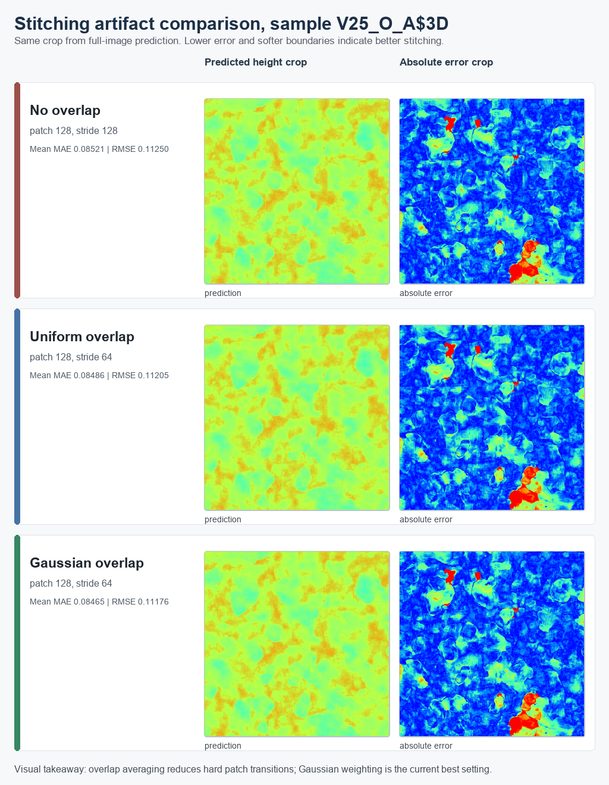
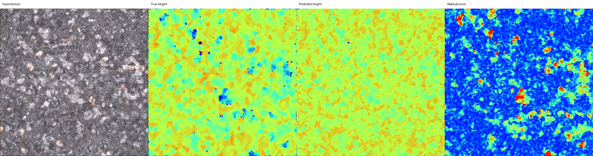

# PT-Projekt

Surface height prediction from Alicona microscope texture images.

The project predicts a normalized 3D height map from a 2D microscope texture image. Since the midterm presentation, the repository has been updated from a basic U-Net demo to a more complete experiment workflow with dataset splits, model comparison, full-image prediction, stitching evaluation and progress documentation.

## Current Stage

The project is currently in the experiment consolidation stage:

```text
raw Alicona samples
-> data validation and .al3d height loading
-> train / validation / test split by complete microscope image
-> patch index generation
-> model training
-> patch-level evaluation
-> full-image sliding-window prediction
-> stitching and resolution comparison
-> report-ready figures and result tables
```

## Data

The raw Alicona dataset is expected locally at:

```text
Versuchsreihe2_B91$prj/
```

It contains 174 complete Alicona samples. Each sample contains:

```text
texture.bmp
qualitymap.bmp
info.xml
icon.bmp
dem.al3d
```

The raw data is not included in this repository because of size and storage limits. Dataset split files and patch-count summaries are committed in `dataset_indices/`; full `patch_index.csv` files are generated locally by `scripts/prepare_dataset.py`.

## Dataset Split

The split is done by complete microscope image, not by randomly mixing patches. This avoids data leakage between training and testing.

| Split | Full images | Sample groups | Purpose |
|---|---:|---|---|
| Train | 120 | V1-V20 | Model training |
| Validation | 24 | V21-V24 | Best-checkpoint selection |
| Test | 30 | V25-V29 | Final generalization evaluation |

Patch counts:

| Patch size | Stride | Train patches | Validation patches | Test patches |
|---:|---:|---:|---:|---:|
| 64 | 64 | 122,880 | 24,576 | 30,720 |
| 128 | 128 | 30,720 | 6,144 | 7,680 |
| 256 | 256 | 7,680 | 1,536 | 1,920 |

## Error Metrics

`MAE_norm`, `MSE_norm` and `RMSE_norm` are computed on min-max normalized height maps:

```text
h_norm = (h_raw - h_min) / (h_max - h_min)
```

These metrics are dimensionless normalized errors, so values below 1 are expected. For complete-image prediction, the script also records raw height-unit errors after inverse min-max scaling.

## Current Results

### Previous Experiment Process

The earlier experiments are retained because they document how the project developed from a basic CNN baseline into the current complete-image workflow.

1. **SimpleCNN baseline** — the first model mostly predicted an average height and did not recover meaningful surface structure.
2. **Small U-Net** — skip connections improved the reconstruction of the global surface geometry, although the output remained blurry.
3. **U-Net with 8,526 patches** — increasing the number of training patches improved the prediction, but patch-boundary artifacts remained visible.
4. **Overlap and height normalization** — overlapping patches increased the effective training data, while min-max height normalization removed unstable and NaN losses.
5. **100-epoch U-Net experiment** — longer training produced the best result of the original experiment series and formed the baseline for the later revision work.

The original figures are preserved in `results/experiment_01_simplecnn.png` through `results/experiment_05_final_100epoch.png`. The detailed development history is retained in `docs/development_log.md`.

### Patch-Level Model Comparison

Results are from the held-out test split using 128 x 128 patches.

| Model | Test patches | MAE_norm | MSE_norm | RMSE_norm |
|---|---:|---:|---:|---:|
| SimpleCNN | 7,680 | 0.0966449065 | 0.0161155819 | 0.1269471617 |
| TransUNet-lite | 7,680 | 0.0899855863 | 0.0149214596 | 0.1221534265 |
| Small U-Net | 7,680 | 0.0852922367 | 0.0128995686 | 0.1135762678 |

Small U-Net is the current best patch-level model. TransUNet-lite improves over SimpleCNN but does not exceed Small U-Net in this experiment.

### Patch Resolution Comparison

Small U-Net was trained with three patch sizes.

| Patch size | Test patches | MAE_norm | MSE_norm | RMSE_norm |
|---:|---:|---:|---:|---:|
| 64 | 30,720 | 0.0872558418 | 0.0133066573 | 0.1153544853 |
| 128 | 7,680 | 0.0852922367 | 0.0128995686 | 0.1135762678 |
| 256 | 1,920 | 0.0861126906 | 0.0128414407 | 0.1133200807 |

The 128 x 128 setting gives the best MAE and is the current main configuration.

### Complete Microscope Image Prediction

Complete images are predicted with sliding-window patch inference and stitching:

```text
complete texture.bmp
-> split into patches
-> predict each patch
-> stitch predictions back to full image
-> save predicted height, error map and summary figure
```

Best complete-image setting:

| Model | Patch size | Prediction stride | Blend | Test full images | Mean MAE_norm | Mean MSE_norm | Mean RMSE_norm |
|---|---:|---:|---|---:|---:|---:|---:|
| Small U-Net | 128 | 64 | Gaussian overlap | 30 | 0.0846515231 | 0.0127101013 | 0.1117579066 |

Stitching comparison with the same Small U-Net checkpoint:

| Stitching | Patch size | Stride | Mean MAE_norm | Mean RMSE_norm |
|---|---:|---:|---:|---:|
| No overlap | 128 | 128 | 0.0852090585 | 0.1124974950 |
| Uniform overlap | 128 | 64 | 0.0848604908 | 0.1120548095 |
| Gaussian overlap | 128 | 64 | 0.0846515231 | 0.1117579066 |

Gaussian overlap reduces patch-boundary artifacts and gives the best full-image result.

Zoomed visual comparison on the same test sample and crop:



## Representative Result



The figure shows input texture, true height, predicted height and absolute error for the test sample `V25_O_A$3D`.

## Repository Structure

```text
PT-Projekt/
├── dataset_indices/
│   ├── patch64/
│   ├── patch128/
│   ├── patch256/
│   └── patch_counts.csv
├── docs/
│   ├── current_stage_report_2026-08-31_cn.md
│   ├── current_stage_report_2026-08-31_cn.docx
│   ├── experiment_run_summary_2026-08-26_cn.md
│   ├── change_report_cn.md
│   └── report_addendum.md
├── models/
│   └── README.md
├── results/
│   ├── model_comparison.csv
│   ├── training_log.csv
│   ├── full_image_metrics.csv
│   └── report_figures/
├── scripts/
│   ├── data_utils.py
│   ├── prepare_dataset.py
│   ├── models.py
│   ├── train.py
│   ├── evaluate.py
│   ├── predict_full_image.py
│   ├── predict_single.py
│   └── run_revision_experiments.ps1
└── README.md
```

## How to Run

Prepare the default 128 x 128 dataset:

```bash
python scripts/prepare_dataset.py --patch-size 128 --stride 128
```

Train the current main model:

```bash
python scripts/train.py --model small_unet --epochs 100 --patch-size 128 --stride 128
```

Evaluate on the test split:

```bash
python scripts/evaluate.py --model small_unet --checkpoint models/small_unet_patch128_stride128_ep100_best.pth --split test
```

Predict all complete test images with Gaussian overlap:

```bash
python scripts/predict_full_image.py --model small_unet --checkpoint models/small_unet_patch128_stride128_ep100_best.pth --split test --all-samples --patch-size 128 --stride 64 --blend gaussian
```

Run the main post-midterm experiment sequence on Windows PowerShell:

```powershell
.\scripts\run_revision_experiments.ps1
```

Run the resolution comparison:

```powershell
.\scripts\run_resolution_experiments.ps1
```

## Notes

- Five selected `*_best.pth` checkpoints are included so the reported models can be evaluated directly. Duplicate `*_last.pth` checkpoints are intentionally excluded; see `models/README.md`.
- Raw Alicona data is intentionally not committed.
- Full per-sample `.npy` outputs are not committed; only summary metrics and selected figures are tracked.
- The current-stage Chinese report is available in `docs/current_stage_report_2026-08-31_cn.md` and `docs/current_stage_report_2026-08-31_cn.docx`.

## References

- U-Net: Ronneberger, Fischer and Brox, "U-Net: Convolutional Networks for Biomedical Image Segmentation", MICCAI 2015.
- TransUNet: Chen et al., "TransUNet: Transformers Make Strong Encoders for Medical Image Segmentation", arXiv:2102.04306.
