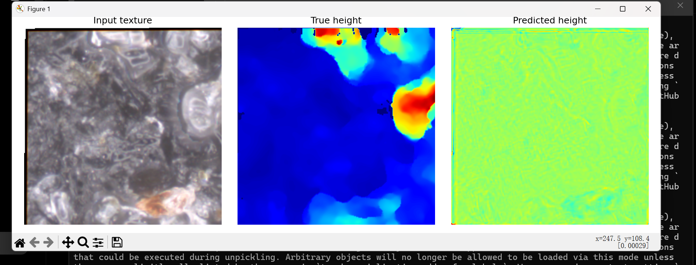
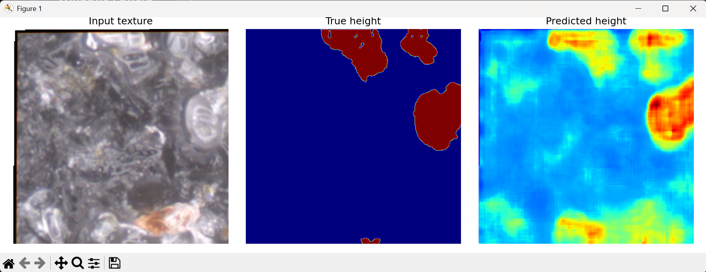
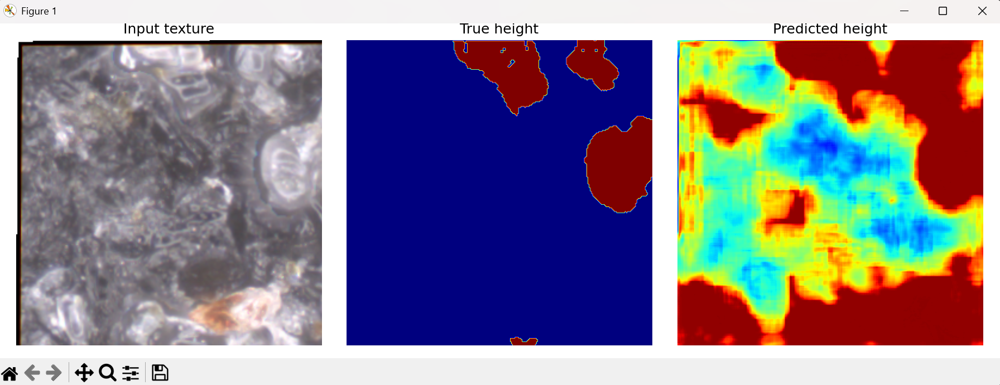
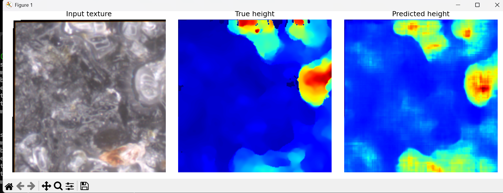
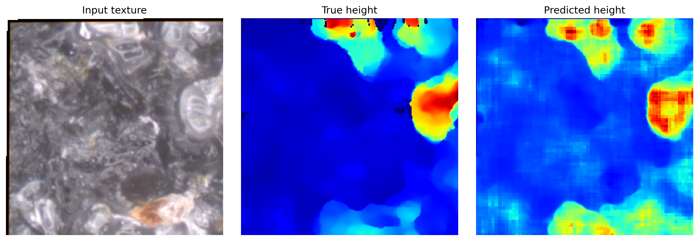

# PT-Projekt

## Surface Height Prediction from Alicona Microscope Images using U-Net

### Project Overview

The goal of this project is to reconstruct surface height maps from Alicona microscope texture images using deep learning.

The workflow includes:

- Dataset preparation
- Height map reconstruction
- Patch generation
- U-Net training
- Surface height prediction
- Result visualization
- Git version control

---

# Workflow

Texture Image

↓

Patch Generation

↓

Training Dataset

↓

U-Net

↓

Height Prediction

---

# Repository Structure

```
PT-Projekt
│
├── scripts
│   ├── prepare_dataset.py
│   ├── train.py
│   └── predict.py
│
├── results
│   ├── experiment_01_simplecnn.png
│   ├── experiment_02_smallunet.png
│   ├── experiment_03_unet_8526patches.png
│   ├── experiment_04_overlap_normalization_30epoch.png
│   └── experiment_05_final_100epoch.png
│
├── docs
│   └── development_log.md
│
├── README.md
└── .gitignore
```

---

# Experimental Results

## Experiment 1 – SimpleCNN

The initial CNN model mainly learned the average height and could not reconstruct the surface structure.



---

## Experiment 2 – Small U-Net

The Small U-Net started learning the global height distribution but remained blurry.



---

## Experiment 3 – U-Net (8526 patches)

The prediction quality improved noticeably, although obvious block artifacts were still present.



---

## Experiment 4 – Overlap + Normalization (30 epochs)

Introducing overlapping patches and height normalization significantly improved training stability.



---

## Experiment 5 – Final Model (100 epochs)

Current best prediction.

The reconstructed height map is much closer to the ground truth.



---

# Current Best Model

| Parameter | Value |
|-----------|-------|
| Network | U-Net |
| Patch Size | 128 × 128 |
| Stride | 192 |
| Epochs | 100 |
| Loss Function | L1 Loss |
| Final Loss | ≈ 0.365 |

---

# Future Work

- Improve local surface details
- Explore deeper U-Net architectures
- Add validation dataset
- Perform quantitative evaluation
- Generate complete 3D surface visualization
- Improve boundary reconstruction

---

# Development History

The complete development process, encountered problems, and optimization steps are documented in:

```
docs/development_log.md
```
